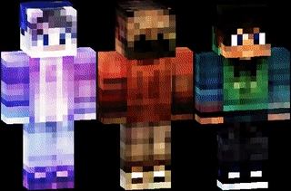

# Minecraft Skin Generator 2.0

This is the newest version of MSG.

Generate new Minecraft Skins with a Convolutional Autoencoder.  
Run app.py or standalone MSG.exe to start the application.
You can find the latest MSG.exe [here](https://github.com/BirnB4um/MC_Skin_Generator/releases/tag/v2.0)

The sliders represent individual features of a skin. Scroll the mousewheel over the sliders to access more less-influential sliders (256 sliders total). Hover over a slider to display its description.

| Keybind | Description |
| ----------- | ----------- |
| 0 | Reset sliders to 0 |
| R | Randomize sliders |
| S | Save skin as an image |
| L | Load a skin from an image (also supports classic skins) |
| H | Pass resulting skin back through the model |
| M | Toggle moving-sliders. Moves sliders smoothly to target values if activated instead of directly jumping to it |
| O | Toggle skin overlay |
| X | Toggle sharpening. Sharpens skin based on sharpness-value if activated |
| C | Toggle color-reduction. Reduces the number of colors used in the skin |

The "Slider range" slider controls the intensity of the sliders.

# Examples 
  

Training Dataset from [here](https://www.kaggle.com/datasets/sha2048/minecraft-skin-dataset)
