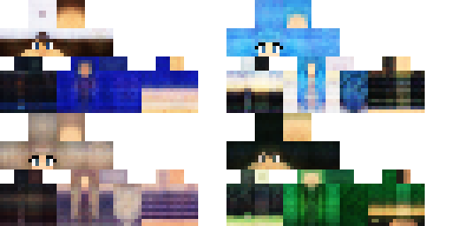

# Minecraft Skin Generator (Old version)

This is the older version of MSG. You can find the newest version [here](../).

Generate new Minecraft Skins with an Autoencoder.  
Run app.py or standalone dist/MSG_old.exe to start the application.  
The model only produces classic skins without overlays.

- The 128 sliders represent the latent space of the AE
- The *intensity* slider changes the range of the main sliders from 0 to 10 (resulting range: -x to x)

| Keybind | Description |
| ----------- | ----------- |
| R | Randomize sliders |
| Shift + R | Randomize sliders as normal distribution |
| M | Randomize sliders maximal (-1, 0, 1) |
| K | Knock sliders a bit |
| 0 | Reset sliders to 0 |
| J | Move sliders (randomizing/knocking sliders changes velocities) |
| H | Converge sliders to equilibrium by feeding the output back into the input of the AE |
| D | Double feed through: like 'H' but just once |
| N | Normalize sliders (effects loading skin, double feed through and converging) |
| S | Save skin as an image |
| L | Load a skin from an image |

Moving sliders example:  
  
More examples [here](https://youtu.be/9HcfFa7BI7k)

Example skins:  

---
Uses [MinePI](https://github.com/benno1237/MinePI) to render 3D Skin.  

Training Dataset from [here](https://www.kaggle.com/datasets/sha2048/minecraft-skin-dataset)
